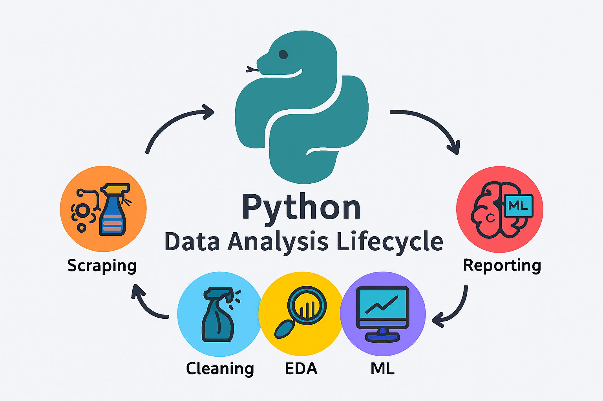

 

 
## Overview
This repository demonstrates the complete data analysis lifecycle using Python.  
The project covers data collection, cleaning, exploratory analysis, machine learning, and reporting.

## Tools Used
- Python (pandas, numpy) for data cleaning and preprocessing
- Matplotlib / Seaborn for visualization
- Scikit-learn for basic machine learning models
- Jupyter Notebook for documentation and reporting

## Workflow
1. Data collection (scraping/API)
2. Cleaning and preprocessing with pandas
3. Exploratory Data Analysis (EDA) with visualizations
4. Machine learning model (classification/regression)
5. Documentation of insights in Jupyter Notebook

## Status
Dataset scraping and implementation in progress.  
This repository will be updated with notebooks, scripts, and visuals.
